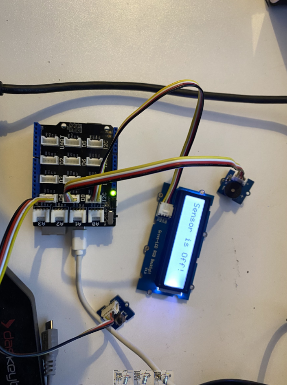

# IoT-team-collaboration-project
This is a group IoT project that uses Arduino software and hardware to solve a real-world problem. For our group project, we are building a hob/stovetop heat sensor safety device designed to alert users if a fire occurs or the stove is left on too long. The device can also warn children and animals from accidentally hurting themselves. 

## Team Report should be posted on your Github account and  include the following:

### Project Title:
Heat sensor (working title)

### Your name(s) & email addresses:
1. Emmanuel Oluwole (S00248432@atu.ie)
2. Ernestas Giedraitis (S00250803@atu.ie) 
3. Garry Ledwith (S00256356@atu.ie)
4. Tadhg Dowdall (S00250843@atu.ie)
5. Samuel Kocych (S00255627@atu.ie)

### Links:  
#### Trello Page:
https://trello.com/b/Qchyc20L/iot-project

#### GitHub Team Page:
https://github.com/GarryLed/IoT-team-collaboration-project
### Links to any data gathered or data analysis planned: 
[Kitchen Alert stove safety device](https://summit.sfu.ca/item/32148)

[Stovetop Overheat Sensor Project" by Christopher Lonczak, Monte Perkins et al.](https://digitalcommons.buffalostate.edu/srcc-sp21-compeng/6/)

[Home safety measures and the risk of unintentional injury among young children: a multicentre case–control study | CMAJ](https://www.cmaj.ca/content/175/8/883.short)

[Stop cooking fires before they happen! : H46-2/05-403E-PDF - Government of Canada Publications - Canada.ca](https://publications.gc.ca/site/eng/9.689623/publication.html)

## Outline of the problem to be solved - supported by your research [1 page + references (font size 12)] 
**Problem to be solved:** 
- Safer kitchens 
- Child safety 
- Adult safety 
- Pet safety
- Fire prevention 
- Injury prevention 
- Carbon monoxide deaths 

Above bullet points are only suggestions and may be changed or modified. This sections requires 1 page and references. 

## Summary of the Project solution  [2 pages] 
Add a summary here (2 pages)

## List of Project Requirements  [outline at least 6 requirements] 

1.	System will notify the user via text message if  a stove/hob has been on for an extended period of time 
2.	System will have lcd screen and buzzer that warns children/elderly/animals if they approach a hot stove top 
3.	System will turn off stove if it is on for a certain amount of time (time can be entered by the user)
4.	System can detects carbon monoxide, which will set the led light, lcd warning message, and buzzer off
5.	Add more here 
6.	Add more here 

Above list may also be modified as it is just there to give us a start. 

## Initial Design – to include sketches of proposed device, proposed code design, proposed hardware setup, description of any APIs or data processing planned
### Sketch: 
* Create a sketch of project 
* Create a sketch of the proposed hardware setup 

### Proposed code design: 
sketch out code design 

### Hardware setup: 
* Explain the hardware setup with images 

Add images here: 

References: 
[The Arduino temperature sensor](https://sensorkit.arduino.cc/sensorkit/module/lessons/lesson/08-the-temperature-sensor)
### API's 
* Describe how API’s will be used and data will be handled 
## Implementation Plan to include equipment needed, parts list, APIs to be used, code samples [3 pages + screenshots/photos/diagrams] 

### Equipment and Parts list: 
- Arduino Yun 
- Groove kit 
- Buzzer 
- Led 
- RGB 

add more parts here

### Code samples: 
Below are two images of the initial code samples using the potentiometer, led, and a lcd screen that displays a warning message when tempertaure goes above a certain number: 

**When temperature is within normal range:** 

**When temperature goes above temp threshold:**

**Here is the link to the code for the above sample:**

[Initial code for heat sensor wiht led and lcd screen with warning message](https://wokwi.com/projects/391986545080816641)

### Prototype Arduino code 
[Code for initial prototype](https://github.com/GarryLed/IoT-team-collaboration-project/blob/main/arduino-initial-prototype-code)

### Arduino Prototype Images: 
**Sensor is connected, but is in an off state**

**Sensor is detecting the current temperature is within the normal range and displays the following message: "Temperature OK: 28.40"**

**Sensor is detecting the current temperature is above the treshold and displays the following message: "Warning: Temp: 31.00"**

### API's
* Send emails to the user 
* send text messages to the user 
* Could notift the local fire brigade in an emergency 

### Screenshots 
Screenshots of progress 
* Sketches 
* Code 
* Hardware 
* Logical flow charts/diagrams 

## Testing approach – how did you plan your software and hardware testing as well as evidence of tests carried out
* Potentiometer for determining a specified temperature
* Find user(s) for initial testing of APIs and notifications 

## Security Analysis to prevent security holes [half page] 
* Review of fire and safety standards 
* Add more info here 

## Future improvements planned and potential next steps in developing the idea further [1 page]
add any potential imporvements here 