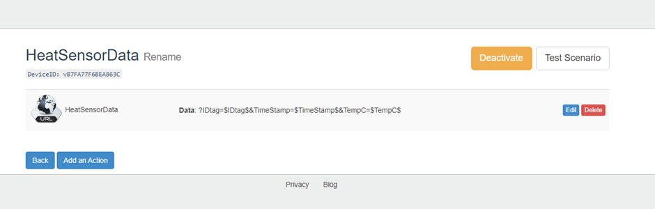
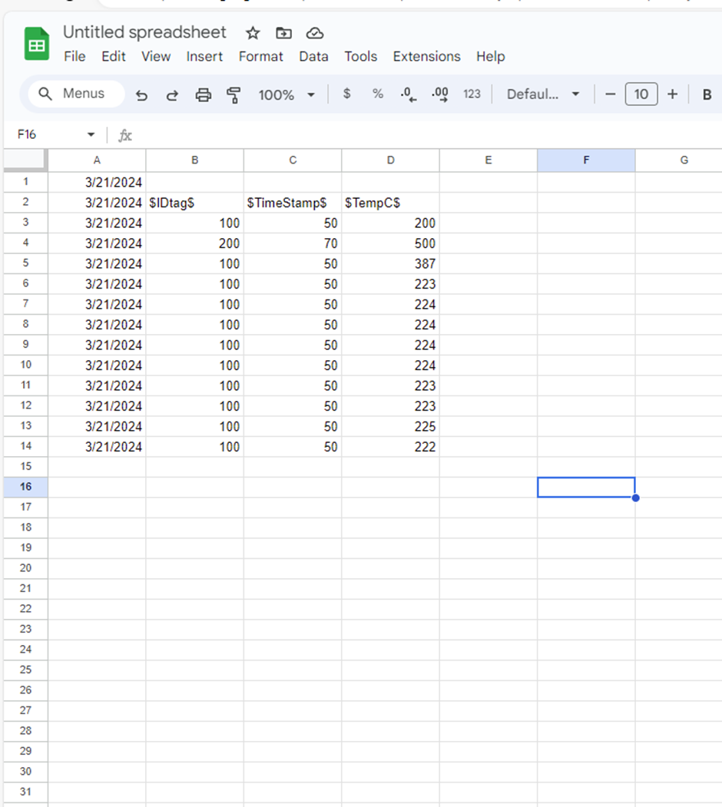
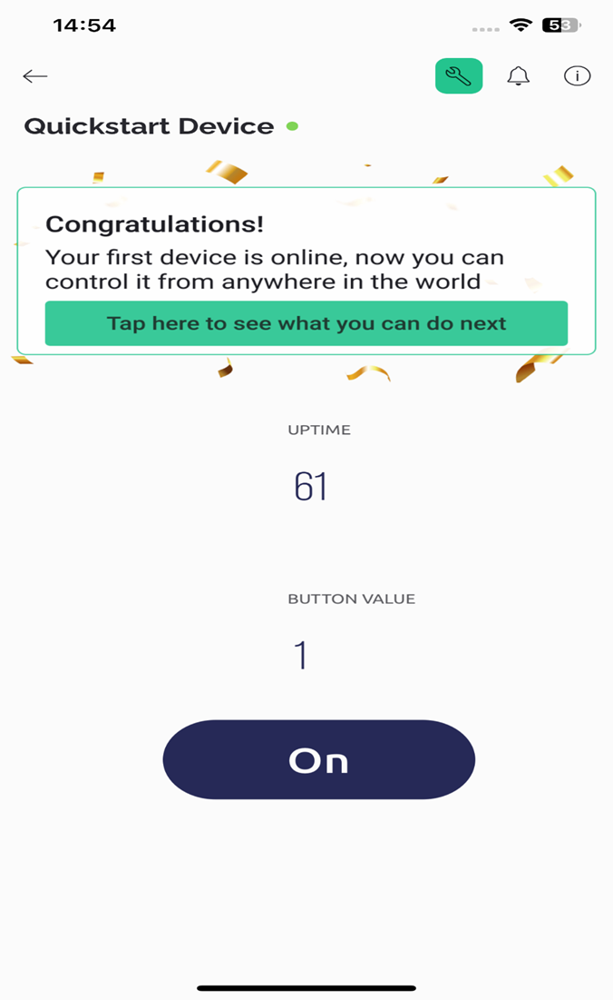

         # IoT-team-collaboration-project
This is a group IoT project that uses Arduino software and hardware to solve a real-world problem. For our group project, we are building a hob/stovetop heat sensor safety device designed to alert users if a fire occurs or the stove is left on too long. The device can also warn children and animals from accidentally hurting themselves. 

## Team Report should be posted on your Github account and  include the following:

### Project Title:
Heat sensor (working title)

### Your name(s) & email addresses:
1. Emmanuel Oluwole (S00248432@atu.ie)
2. Ernestas Giedraitis (S00250803@atu.ie) 
3. Garry Ledwith (S00256356@atu.ie)
4. Tadhg Dowdall (S00250843@atu.ie)
5. Samuel Kocych (S00255627@atu.ie)

### Links:  
#### Trello Page:
https://trello.com/b/Qchyc20L/iot-project

#### GitHub Team Page:
https://github.com/GarryLed/IoT-team-collaboration-project
### Links to any data gathered or data analysis planned: 
[Kitchen Alert stove safety device](https://summit.sfu.ca/item/32148)

[Stovetop Overheat Sensor Project" by Christopher Lonczak, Monte Perkins et al.](https://digitalcommons.buffalostate.edu/srcc-sp21-compeng/6/)

[Home safety measures and the risk of unintentional injury among young children: a multicentre case–control study | CMAJ](https://www.cmaj.ca/content/175/8/883.short)

[Stop cooking fires before they happen! : H46-2/05-403E-PDF - Government of Canada Publications - Canada.ca](https://publications.gc.ca/site/eng/9.689623/publication.html)

## Outline of the problem to be solved - supported by your research [1 page + references (font size 12)] 
**Problem to be solved:** 
- Safer kitchens 
- Child safety 
- Adult safety 
- Pet safety
- Fire prevention 
- Injury prevention 
- Carbon Monoxide is a poisonous gas which is sometimes reffered to as "The Silent Killer". When researching about Kitchen safety devices we thought it would be a good idea to have an all in one device which could detect temperature, carbon monoxide and the air quality. Since Carbon Monoxide is a poisonous, flammable gas that is colorless, odorless and tasteless we thought that receiving a notification which will help warn people of the gas would be perfect to include in a kitchen safety device.

## Summary of the Project solution  [2 pages]

**Overview:**

Our team is building a heat sensor device designed to improve kitchen safety. The device can attach to an oven stovetop and measure the stove's heat temperature. In the case of a stovetop overheating, the monitor will notify the user via text message or email in real-time. Additionally, the heat sensor can notify the user if a stove is left on for an extended period of time and also notify the user and/or give the user the ability to turn the stove off remotely.

Prototype: 
The prototype we came up with was an arduino with a button to enable disable and reset the device and an LED screen and buzzer for the output to what it is doing e.g wether its working or the temparature is too high. we programmed it so when we put in a temparature value above a certain threshold it would turn on a buzzer to alarm the user of the temparature being too high.

## List of Project Requirements  [outline at least 6 requirements] 

1.	System will notify the user via text message if  a stove/hob has been on for an extended period of time 
2.	System will have lcd screen and buzzer that warns children/elderly/animals if they approach a hot stove top 
3.	System will turn off stove if it is on for a certain amount of time (time can be entered by the user)
4.	System can detects carbon monoxide, which will set the led light, lcd warning message, and buzzer off
5.	Designing a user-friendly interface for receiving alerts 
6.	Conduct adequate testing on the project to ensure there is no false alerts.

Above list may also be modified as it is just there to give us a start. 

## Initial Design – to include sketches of proposed device, proposed code design, proposed hardware setup, description of any APIs or data processing planned
### Sketch: 
* Create a sketch of project 
* Create a sketch of the proposed hardware setup 

### Proposed code design: 
sketch out code design 

### Hardware setup: 
* Explain the hardware setup with images 

Add images here: 

References: 
[The Arduino temperature sensor](https://sensorkit.arduino.cc/sensorkit/module/lessons/lesson/08-the-temperature-sensor)
### API's 
* Describe how API’s will be used and data will be handled 
## Implementation Plan to include equipment needed, parts list, APIs to be used, code samples [3 pages + screenshots/photos/diagrams] 

### Equipment and Parts list: 
- Arduino Yun 
- Groove kit 
- Buzzer 
- Led 
- RGB 

### Code samples: 
Below are two images of the initial code samples using the potentiometer, led, and a lcd screen that displays a warning message when tempertaure goes above a certain number: 

**When temperature is within normal range:** 

**When temperature goes above temp threshold:**

**Here is the link to the code for the above sample:**

[Initial code for heat sensor wiht led and lcd screen with warning message](https://wokwi.com/projects/391986545080816641)

### Prototype Arduino code 
[Code for initial prototype](https://github.com/GarryLed/IoT-team-collaboration-project/blob/main/arduino-initial-prototype-code)

### Arduino Prototype Images: 
**Sensor is connected, but is in an off state**

**Sensor is detecting the current temperature is within the normal range and displays the following message: "Temperature OK: 28.40"**

**Sensor is detecting the current temperature is above the treshold and displays the following message: "Warning: Temp: 31.00"**

### API's
* Send emails to the user 
* Send text messages to the user 
* Notify the local fire brigade in an emergency
* Monitor the real time temparature of the stove carbon monoxide levels, air quality and any other relevent information.

## Testing approach – how did you plan your software and hardware testing as well as evidence of tests carried out
* Potentiometer for determining a specified temperature
* Find user(s) for initial testing of APIs and notifications 
add more info here 
Prototype Test :
When testing our original prototype we didn't have access to a temperature sensor. For testing purposes we decided to put the temperature value into our code storing it as a variable. This meant that when we were testing we were able to change the temperature threshold and current temperature. We inputted several different test cases for different temperature values to ensure that the code functioned appropriately. Examples of test cases included be -1 degree, 20 degrees and so forth.

## Security Analysis to prevent security holes [half page] 
* Review of fire and safety standards 
* Ensuring that all electrical components used in your device comply with relevant safety standards.
* Sensors used for detecting heat, air quality, and carbon monoxide should be calibrated and tested to ensure accurate readings.

## Future improvements planned and potential next steps in developing the idea further [1 page]

### Automated Emergency Notifications
We can develop a system that not only notifies the user but also alerts the local fire department or emergency services in case the stove is left unattended for an extended period.
This notification system ensures a swift response to potential hazards, even if the user is unable to react to alerts themselves, significantly reducing the risk of accidents.

### More User-Friendly Platform
Create a more intuitive and user-friendly interface that allows users to seamlessly configure emergency notification settings.
Provide customizable options for selecting recipients of emergency alerts, including family members, neighbors, or caretakers, in addition to the user himself.
Include functions for setting up emergency contacts and defining escalation protocols for different types of situations, ensuring comprehensive coverage in emergencies.

### Integration with Smart Home Ecosystems
Integrating our kitchen security device with existing smart home ecosystems such as Google Home, Amazon Alexa and Apple HomeKit can significantly increase user convenience and comfort, so user can get better experience from using. By leveraging these platforms, users can seamlessly control and monitor stove usage using voice commands, adding another layer of accessibility and ease of use to the system. 

### Expansion of Sensor Capabilities
Expanding our sensoring capabilities could help reduce the risk of sending false alarms. Sensors which could be implemented with this project include, carbon monoxide sensor, air quality sensor and CO2 sensors. These sensors could provide valuable data to indicate the problem with more accuracy. This comprehensive approach of using multiple sensors could aid in fire prevention, ensuring in a safer environment

### Default timer
We can work on setting a default timer as when been left for a particular period of time it should automatically notify the user if no respond within another period of time and it very hot it should then proceed to contact emmergency or emergency recipent if reachable.

****
# Project 2 

## Final Project Report Update
Prepare an update of your original report (Turn on Track Changes) Internet & Machine Learning Functionality:
This submission should feature a further refinement or inclusion of some Internet functionality e.g. data logged in a spreadsheet, email notifications, a Blynk app, or Web User Interface etc. and should include: sdcsdf

a)	Description of Internet functionality planned, including details of APIs used (e.g. PushingBox, Blynk, REST Web Service based UI)

## Internet Functionality
### Data logging:
 We used an Arduino Scrip, Google Sheets API and PushingBox API  to send and update data to Google Sheets from the Heat sensor device. This data can be used for data analysis and Machine Learning. 
 

 

### Email notifications.

We will use Blynk for email notifications and alerts to the end user. Blynk has the capability to send and receive emails from the application by setting up certain conditions. 
We can create conditions in the Blynk app based on the heat sensor ‘state’, which will notify the user when a pre-defined condition is triggered based on the heat sensors data. 

For example: 
Uses will be able to choose a time limit for a stove top to be on in the ‘safe’ condition, and if it exceeds this threshold, the user will be notified via email. 

### Integration with Blynk app
Blynk software allows us to connect our hardware device to an integrated software system that allows us to build a mobile app so the user can be notified via the application if stoves or hobs have been left on for an extended period.
Our initial connection from a Yun device to Blynk:  
 

**Garry will take section (a) above** 

 - [ ] incomplete
 - [x] complete 

b)	Secondary research, on similar internet projects you have found online, to support your implementation and validate the idea

**Need someone to take (b)**
 - [x] incomplete
 - [ ] complete 
 
c)	Ideas for the potential future application of Machine Learning to enhance your project functionality – specify a Machine Learning algorithm and a description of the data you would use

### Potential future application of Machine Learning

Data collected and analysed via the heat sensor app could be used with machine learning to detect patterns in the data and use that data to help prevent or minimize kitchen fires. The relationship discovery machine learning model would be a suitable algorithm for this use case because it is designed to identify patterns in data and then determine the relationships between various data points.  

**Garry will take section (c) above** 

 - [x] incomplete
 - [ ] complete 

d)	Video of your final working prototype

**Emmanual will shoot the video for this** 

 - [x] incomplete
 - [ ] complete 
## Academic Poster 
add academic poster in this section 

**Tadhg will start the poster (team can help during our team meeting)**

 - [x] incomplete
 - [ ] complete 
## Critical Analysis of Application

The critical analysis of our application is broken into the following key areas: system effects on individuals and society, identifying assumptions , validating  assumptions , reflecting on new assumptions, considering different perspectives, "what-if" scenarios, and taking informed action. 

### 1. Effects on Individuals and Society: 

- **On Individuals:** The device is designed to create a safer kitchen in the home by preventing serious injury or death from kitchen fires.

- **On Society:** By reducing the number of kitchen fires, the device can lower the number of potential home insurance claims related to fire damage. This reduction in claims could lower the price of home insurance for all, which would benefit the economy.  

### 2. Identifying Assumptions:

- **Assumptions about the users:** Older people will understand how to use the device and application. Also, that all users can hear alerts.

- **Assumptions about the effectiveness of the Heat Sensor device:** It is assumed that the actual device will prevent injuries or potential deaths by alerting users in that a stove top has been left on or a fire has broken out. 

- **Assumptions about economic benefits:** The device will reduce the number of insurance claims due to lower household fires. 

### 3. Validating Assumptions 

- **Testing Groups:** To validate the assumptions about older users being able to understand and use the application, a small test group could be set up to gauge these users when using the device and application.

- **Gathering Data:** To validate the assumption that the device can track cooking patterns and alert users in the event of a stove being left on or a kitchen fire, we will connect the devices via API’s like Blynk, Google Sheets and PushingBox for collecting data, and this data can be used with machine learning algorithms to find patterns and relationships. 

### 4. Reflecting on Assumptions 

### 5. Considering Different Perspectives 

### 6. Imagining What-if Scenarios 

### 7. Taking Informed Action 

**Garry will take this section** 

 - [x] incomplete
 - [ ] complete 

****
## Ethics Risk Analysis of the future Application

**Ernestas will take this section**
 - [x] incomplete
 - [ ] complete 